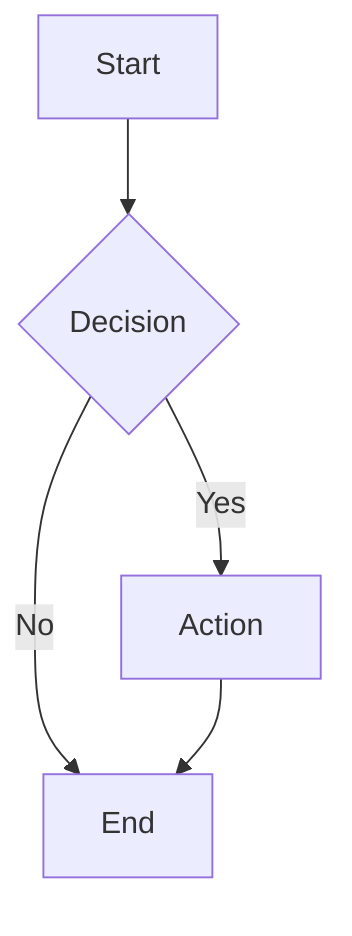
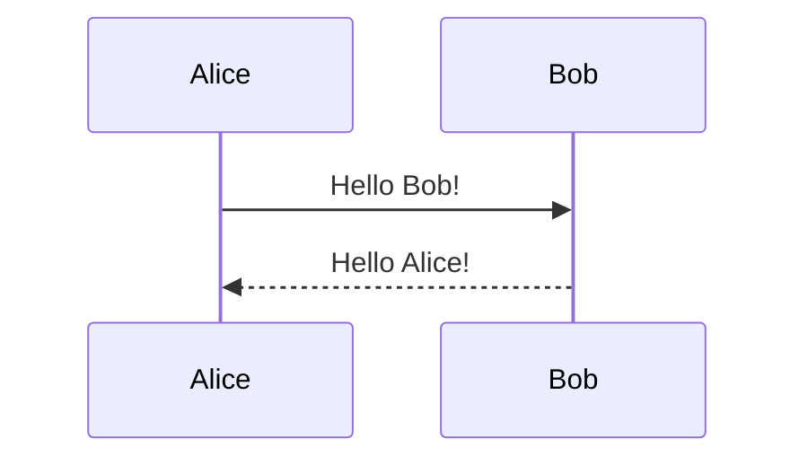
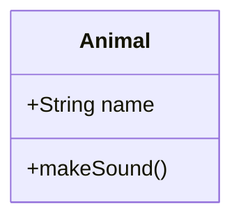

# 🚀 Quick Start Guide

Get up and running with Mermaid Diagram Generator in minutes!

## 📋 Prerequisites

- **Node.js 18+** - [Download here](https://nodejs.org/)
- **pnpm** (recommended) - `npm install -g pnpm`
- **Git** - [Download here](https://git-scm.com/)

## ⚡ 5-Minute Setup

### 1. Clone and Install
```bash
# Clone the repository
git clone <your-repo-url>
cd mermaiddg

# Install dependencies (takes ~30 seconds)
pnpm install
```

### 2. Start Development Server
```bash
# Start the development server
pnpm run dev

# Open your browser to http://localhost:5173
```

### 3. Create Your First Diagram
1. **Click the "+" button** in the toolbar
2. **Click anywhere on the canvas** to place a diagram
3. **Double-click the diagram** to edit it
4. **Modify the Mermaid code** and see live preview
5. **Click "Save"** - your diagram is automatically saved!

## 🎯 Basic Usage

### Creating Diagrams
- **Add Tool**: Click "+" then click on canvas
- **Select Tool**: Click arrow to select and move diagrams
- **Edit**: Double-click any diagram to edit
- **Delete**: Select diagram and press Delete key

### Navigation
- **Zoom**: Mouse wheel or toolbar buttons
- **Pan**: Drag empty canvas area
- **Reset**: Use toolbar reset button

### Editing
- **Live Preview**: See changes as you type
- **Templates**: Choose from pre-built templates
- **Syntax Help**: Hover over help icons

## 📊 Diagram Types

### Flowchart


### Sequence Diagram


### Class Diagram


## 🔧 Common Tasks

### Export Diagrams
1. Click **Export** button in toolbar
2. Choose format: PNG, SVG, or Code
3. Select diagrams to export
4. Download files

### Save and Load
- **Auto-save**: Diagrams save automatically to browser storage
- **Persistence**: Diagrams persist between sessions
- **Clear All**: Use sidebar options to clear all diagrams

### Keyboard Shortcuts
- **Delete**: Remove selected diagram
- **Ctrl+D**: Duplicate selected diagram
- **Mouse Wheel**: Zoom in/out
- **Drag**: Move diagrams or pan canvas

## 🐳 Docker Quick Start

### Option 1: Automated Script
```bash
# Make script executable and run
chmod +x build.sh
./build.sh
```

### Option 2: Manual Docker
```bash
# Build image
docker build -t mermaid-app .

# Run container
docker run -d -p 3000:80 --name mermaid-app mermaid-app

# Open http://localhost:3000
```

### Option 3: Docker Compose
```bash
# Start with compose
docker-compose up -d

# Open http://localhost:3000
```

## 🛠️ Development Commands

```bash
# Development
pnpm run dev          # Start dev server
pnpm run build        # Build for production
pnpm run preview      # Preview production build
pnpm run lint         # Run linting

# Docker
./build.sh            # Automated Docker build
docker-compose up     # Start with Docker Compose
```

## 🎨 Customization

### Themes
Edit `src/components/DiagramRenderer.tsx`:
```typescript
themeVariables: {
  primaryColor: "#your-color",
  primaryTextColor: "#your-text-color",
  // ... more theme options
}
```

### Templates
Add new templates in `src/data/templates.ts`:
```typescript
{
  id: "my-template",
  name: "My Template",
  description: "Custom template",
  category: "Custom",
  code: `graph TD\n    A --> B`
}
```

## 🐛 Troubleshooting

### Common Issues

**Diagrams not showing:**
- Check browser console for errors
- Verify Mermaid syntax is valid
- Try refreshing the page

**Build errors:**
- Clear node_modules: `rm -rf node_modules && pnpm install`
- Check Node.js version: `node --version` (should be 18+)
- Update dependencies: `pnpm update`

**Port already in use:**
- Change port: `pnpm run dev --port 3001`
- Kill existing process: `lsof -ti:5173 | xargs kill`

### Getting Help
- 📖 **Full Documentation**: See [README.md](README.md)
- 🐛 **Report Issues**: [GitHub Issues](https://github.com/your-username/mermaiddg/issues)
- 💬 **Discussions**: [GitHub Discussions](https://github.com/your-username/mermaiddg/discussions)
- 📚 **Mermaid Docs**: [mermaid.js.org](https://mermaid.js.org/)

## 🎉 Next Steps

1. **Explore Templates**: Try different diagram types
2. **Read Documentation**: Check out the full [README.md](README.md)
3. **Customize**: Modify themes and add your own templates
4. **Deploy**: Use Docker for production deployment
5. **Contribute**: See [CONTRIBUTING.md](CONTRIBUTING.md) to contribute

---

**Happy Diagramming!** 🎨

*Need more help? Check the [full documentation](README.md) or [open an issue](https://github.com/your-username/mermaiddg/issues).*
